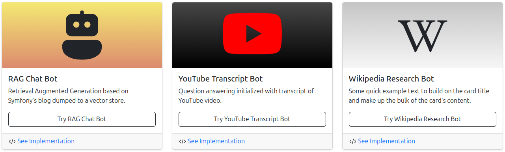

# LLM Chain - Symfony Demo Chatbot Application

Simple Symfony demo application on top of [LLM Chain](https://github.com/php-llm/llm-chain) and its [integration bundle](https://github.com/php-llm/llm-chain-bundle).

## Examples


## Requirements

What you need to run this demo:

* Internet Connection
* Terminal & Browser
* [Git](https://git-scm.com/) & [GitHub Account](https://github.com)
* [Docker](https://www.docker.com/) with [Docker Compose Plugin](https://docs.docker.com/compose/)
* Your Favorite IDE or Editor
* An [OpenAI API Key](https://platform.openai.com/docs/api-reference/create-and-export-an-api-key)

## Technology

This small demo sits on top of following technologies:

* [PHP >= 8.4](https://www.php.net/releases/8.4/en.php)
* [Symfony 7.2 incl. Twig, Asset Mapper & UX](https://symfony.com/)
* [Bootstrap 5](https://getbootstrap.com/docs/5.0/getting-started/introduction/)
* [OpenAI's GPT & Embeddings](https://platform.openai.com/docs/overview)
* [ChromaDB Vector Store](https://www.trychroma.com/)
* [FrankenPHP](https://frankenphp.dev/)

## Setup

The setup is split into three parts, the Symfony application, the OpenAI configuration, and initializing the Chroma DB.

### 1. Symfony App

Checkout the repository, start the docker environment and install dependencies:
```shell
git clone git@github.com:php-llm/symfony-demo.git
cd symfony-demo
docker compose up -d
docker compose run composer install --no-scripts
```

Now you should be able to open https://localhost/ in your browser,
and the chatbot UI should be available for you to start chatting.

### 2. OpenAI Configuration

For using GPT and embedding models from OpenAI, you need to configure an OpenAI API key as environment variable.
This requires you to have an OpenAI account, create a valid API key and set it as `OPENAI_API_KEY` in `.env.local` file.

Verify the success of this step by running the following command:
```shell
docker compose exec app bin/console debug:dotenv
```

You should be able to see the `OPENAI_API_KEY` in the list of environment variables.

### 3. Chroma DB Initialization

The Chroma DB is a vector store that is used to store embeddings of the chatbot's context.

To initialize the Chroma DB, you need to run the following command:
```shell
docker compose exec app bin/console app:blog:embed -vv
```

Now you should be able to run the test command and get some results:
```shell
docker compose exec app bin/console app:chroma:test
```

**Don't forget to set up the project in your favorite IDE or editor.** 

## Functionality

* The chatbot application is a simple and small Symfony 7.2 application.
* The UI is coupled to a Twig LiveComponent, that integrates different `Chat` implementations on top of the user's session.
* You can reset the chat context by hitting the `Reset` button in the top right corner.
* You find three different usage scenarios in the upper navbar.
