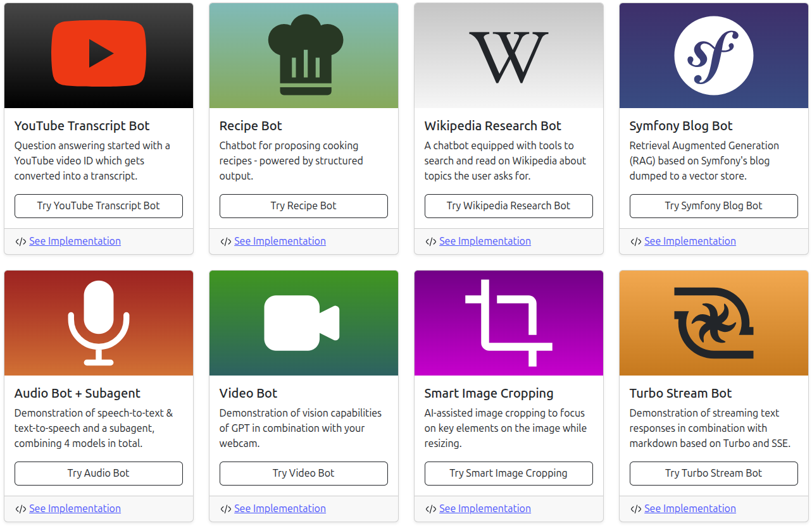

# Symfony AI - Demo Application

Symfony application demoing Symfony AI components.

## Examples



## Requirements

What you need to run this demo:

* Internet Connection
* Terminal & Browser
* [Git](https://git-scm.com/) & [GitHub Account](https://github.com)
* [Docker](https://www.docker.com/) with [Docker Compose Plugin](https://docs.docker.com/compose/)
* Your Favorite IDE or Editor
* An [OpenAI API Key](https://platform.openai.com/docs/api-reference/create-and-export-an-api-key)

## Technology

This small demo sits on top of following technologies:

* [PHP >= 8.4](https://www.php.net/releases/8.4/en.php)
* [Symfony 7.3 incl. Twig, Asset Mapper & UX](https://symfony.com/)
* [Bootstrap 5](https://getbootstrap.com/docs/5.0/getting-started/introduction/)
* [OpenAI's GPT & Embeddings](https://platform.openai.com/docs/overview)
* [ChromaDB Vector Store](https://www.trychroma.com/)
* [FrankenPHP](https://frankenphp.dev/)

## Setup

The setup is split into three parts, the Symfony application, the OpenAI configuration, and initializing the Chroma DB.

### 1. Symfony App

Checkout the repository, start the docker environment and install dependencies:

```shell
git clone git@github.com:symfony/ai-demo.git
cd ai-demo
composer install
docker compose up -d
symfony serve -d
```

Now you should be able to open https://localhost:8000/ in your browser,
and the chatbot UI should be available for you to start chatting.

> [!NOTE]
> You might have to bypass the security warning of your browser with regard to self-signed certificates.

### 2. OpenAI Configuration

For using GPT and embedding models from OpenAI, you need to configure an OpenAI API key as environment variable.
This requires you to have an OpenAI account, create a valid API key and set it as `OPENAI_API_KEY` in `.env.local` file.

```shell
echo "OPENAI_API_KEY='sk-...'" > .env.local
```

Verify the success of this step by running the following command:

```shell
symfony console debug:dotenv
```

You should be able to see the `OPENAI_API_KEY` in the list of environment variables.

### 3. Chroma DB Initialization

The [Chroma DB](https://www.trychroma.com/) is a vector store that is used to store embeddings of the chatbot's context.

To initialize the Chroma DB, you need to run the following command:

```shell
symfony console ai:store:index blog -vv
```

Now you should be able to retrieve documents from the store:

```shell
symfony console ai:store:retrieve blog "Week of Symfony"
```

**Don't forget to set up the project in your favorite IDE or editor.**

## Functionality

* The chatbot application is a simple and small Symfony 7.3 application.
* The UI is coupled to a [Twig LiveComponent](https://symfony.com/bundles/ux-live-component/current/index.html), that integrates different `Chat` implementations on top of the user's session.
* You can reset the chat context by hitting the `Reset` button in the top right corner.
* You find three different usage scenarios in the upper navbar.

### MCP

Demo MCP server added with a `current-time` tool to return the current time, with an optional format string.

To add the server, add the following configuration to your MCP Client's settings, e.g. your IDE:
```json
{
    "servers": {
        "symfony": {
            "command": "php",
            "args": [
                "/your/full/path/to/bin/console",
                "mcp:server"
            ]
        }
    }
}
```

#### Testing the MCP Server

You can test the MCP server by running the following command to start the MCP client:

```shell
symfony console mcp:server
```

**With plain JSON RPC requests**

Then, you can initialize the MCP session with the following JSON RPC request:

```json
{ "jsonrpc": "2.0", "id": 1, "method": "initialize", "params": { "protocolVersion": "2024-11-05", "capabilities": {}, "clientInfo": { "name": "demo-client", "version": "dev" } } }
```

And, to request the list of available tools:

```json
{ "jsonrpc": "2.0", "id": 2, "method": "tools/list" }
```

**With MCP Inspector**

For testing, you can also use the [MCP Inspector](https://modelcontextprotocol.io/docs/tools/inspector):

```shell
npx @modelcontextprotocol/inspector php bin/console mcp:server
```

Which opens a web UI to interactively test the MCP server.
