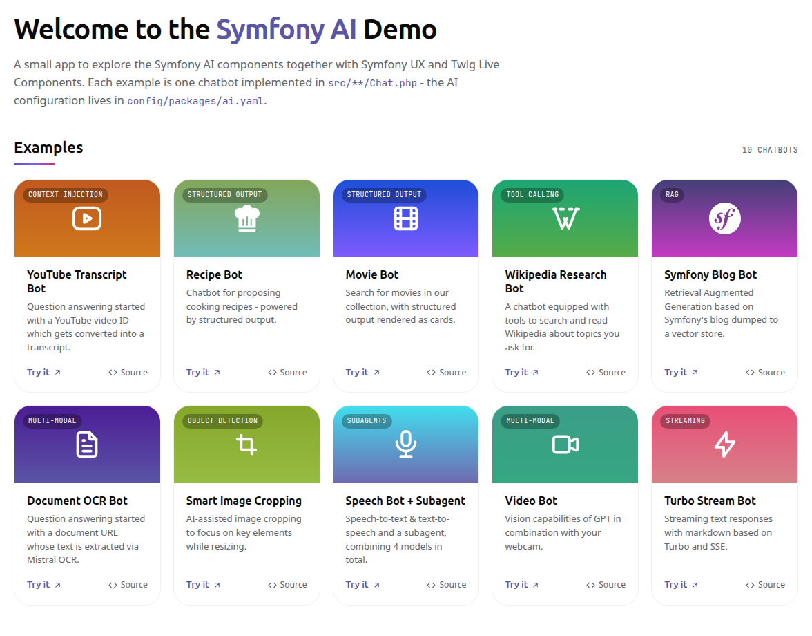

# Symfony AI - Demo Application

Symfony application demoing Symfony AI components.

## Examples



## Requirements

What you need to run this demo:

* Internet Connection
* Terminal & Browser
* [Git](https://git-scm.com/) & [GitHub Account](https://github.com)
* [Docker](https://www.docker.com/) with [Docker Compose Plugin](https://docs.docker.com/compose/)
* Your Favorite IDE or Editor
* An [OpenAI API Key](https://platform.openai.com/docs/api-reference/create-and-export-an-api-key)

## Technology

This small demo sits on top of following technologies:

* [PHP >= 8.4](https://www.php.net/releases/8.4/en.php)
* [Symfony 8.0 incl. Twig, Asset Mapper & UX](https://symfony.com/)
* [Bootstrap 5](https://getbootstrap.com/docs/5.0/getting-started/introduction/)
* [OpenAI's GPT & Embeddings](https://platform.openai.com/docs/overview)
* [PostgreSQL with pgvector](https://github.com/pgvector/pgvector)
* [FrankenPHP](https://frankenphp.dev/)

## Setup

The setup is split into three parts, the Symfony application, the OpenAI configuration, and initializing PostgreSQL.

### 1. Symfony App

Checkout the repository, start the docker environment and install dependencies:

```shell
git clone git@github.com:symfony/ai-demo.git
cd ai-demo
composer install
docker compose up -d
symfony serve -d
```

Now you should be able to open https://localhost:8000/ in your browser,
and the chatbot UI should be available for you to start chatting.

> [!NOTE]
> You might have to bypass the security warning of your browser with regard to self-signed certificates.

### 2. OpenAI Configuration

For using GPT and embedding models from OpenAI, you need to configure an OpenAI API key as environment variable.
This requires you to have an OpenAI account, create a valid API key and set it as `OPENAI_API_KEY` in `.env.local` file.

```shell
echo "OPENAI_API_KEY='sk-...'" > .env.local
```

Verify the success of this step by running the following command:

```shell
symfony console debug:dotenv
```

You should be able to see the `OPENAI_API_KEY` in the list of environment variables.

### 3. PostgreSQL Vector Store Initialization

[PostgreSQL with pgvector](https://github.com/pgvector/pgvector) is used to store embeddings of the chatbot's context.

To initialize the vector store, you need to run the following command:

```shell
symfony console ai:store:setup ai.store.postgres.symfony_blog
symfony console ai:store:index blog -vv
```

Now you should be able to retrieve documents from the store:

```shell
symfony console ai:store:retrieve blog "Week of Symfony"
```

**Don't forget to set up the project in your favorite IDE or editor.**

## Testing

```shell
vendor/bin/phpunit                  # unit and integration tests
vendor/bin/phpunit --testsuite e2e  # end-to-end tests in a real browser
```

### End-to-End Tests

The `e2e` suite uses [Symfony Panther](https://github.com/symfony/panther) to click through all ten
use cases and assert the Symfony AI panel of the profiler for the very request the click triggered.
Every test calls an AI platform for real, which costs money and takes time - the suite is therefore
excluded from the default one, and meant to be run locally.

Next to the setup above, it needs:

* **Chrome or Chromium** with a matching `chromedriver`, which `vendor/bin/bdi detect drivers`
  downloads into `drivers/`. If only a Snap or Flatpak Chromium is installed, point Panther at it
  with `PANTHER_CHROME_BINARY` in `.env.test.local`.
* **API keys** in `.env.local`, or exported in your environment - a test is skipped when the key of
  its use case is missing: `OPENAI_API_KEY` for eight of them, `HUGGINGFACE_API_KEY` for the image
  cropping, `MISTRAL_API_KEY` for the document OCR.
* **ffmpeg** (optional) to convert the audio fixture for the fake microphone of the speech use case.

The blog store does not need to be indexed beforehand: `StoreTest` drives the indexing pipeline
through the console commands, and `BlogTest` sets the store up and indexes it when it is empty. Both
skip themselves when the database is not running.

Panther boots the application in the **dev** environment, because the profiler - and with it the
Symfony AI panel - only collects data with `kernel.debug` enabled. The web server therefore reads
the real API keys from `.env.local` itself. Chrome fakes camera and microphone, so the video and
speech use cases run without a human in front of the screen.

```shell
vendor/bin/phpunit --testsuite e2e --filter BlogTest      # a single use case
PANTHER_NO_HEADLESS=1 vendor/bin/phpunit --testsuite e2e  # watch the browser
```

Screenshots of failing tests are written to `var/error-screenshots/`.

## Functionality

* The chatbot application is a simple and small Symfony 8.0 application.
* The UI is coupled to a [Twig LiveComponent](https://symfony.com/bundles/ux-live-component/current/index.html), that integrates different `Chat` implementations on top of the user's session.
* You can reset the chat context by hitting the `Reset` button in the top right corner.
* You find three different usage scenarios in the upper navbar.

### MCP

Demo MCP server exposing a `current-time` tool and a **Movies** MCP App — an interactive HTML UI (`#[AsMcpApp]`)
that renders the movie collection as a searchable grid in hosts supporting [MCP Apps](https://github.com/modelcontextprotocol/ext-apps).

To add the server, add the following configuration to your MCP Client's settings, e.g. your IDE:
```json
{
    "servers": {
        "symfony": {
            "command": "php",
            "args": [
                "/your/full/path/to/bin/console",
                "mcp:server"
            ]
        }
    }
}
```

#### Testing the MCP Server

You can test the MCP server by running the following command to start the MCP client:

```shell
symfony console mcp:server
```

**With plain JSON RPC requests**

Then, you can initialize the MCP session with the following JSON RPC request:

```json
{ "jsonrpc": "2.0", "id": 1, "method": "initialize", "params": { "protocolVersion": "2024-11-05", "capabilities": {}, "clientInfo": { "name": "demo-client", "version": "dev" } } }
```

And, to request the list of available tools:

```json
{ "jsonrpc": "2.0", "id": 2, "method": "tools/list" }
```

**With MCP Inspector**

For testing, you can also use the [MCP Inspector](https://modelcontextprotocol.io/docs/tools/inspector):

```shell
npx @modelcontextprotocol/inspector php bin/console mcp:server
```

Which opens a web UI to interactively test the MCP server.

## AI Mate - Development CLI

[Symfony AI Mate](https://github.com/symfony/ai-mate) is a command-line assistant that gives coding
agents Symfony-specific knowledge about this application. There is no server to start: the agent
runs `vendor/bin/mate` like any other command.

### Installation & Setup

**This demo is already configured!** For new projects you can set up AI Mate as follows:

```shell
# Install AI Mate
composer require --dev symfony/ai-mate

# Initialize configuration
vendor/bin/mate init

# Discover available tools
vendor/bin/mate discover
```

`mate init` writes the instructions your agent reads (`mate/AGENT_INSTRUCTIONS.md` plus a managed
block in `AGENTS.md`, imported by `CLAUDE.md`) and installs the skills into `.agents/skills/`, with
a mirror in `.claude/skills/`. No client-specific configuration file is involved.

### Running Tools

```shell
vendor/bin/mate tools:list                            # what is available
vendor/bin/mate tools:inspect symfony-ai-features     # parameters and JSON input schema
vendor/bin/mate tools:call symfony-ai-features        # run it
vendor/bin/mate tools:call symfony-profiler-list --limit=1
```

### Custom Capability Example

This demo includes a **`symfony-ai-features`** tool (see `mate/src/SymfonyAiFeaturesTool.php`) that analyzes the project's
AI configuration and reports all available platforms, agents, tools, stores, and packages.

**Try it in your coding agent:**

> "Which Symfony AI features are available in this demo?"
>
> "What AI agents are configured in this project?"
>
> "Show me all the Symfony AI tools and their configuration"
>
> "What is the current PHP version used in this project?"
>
> "Is the php extension intl installed?"

The agent will call `symfony-ai-features` and the other Mate tools to answer from the project
itself rather than from reading the code.

### Creating Custom Tools

Add a class with a public method carrying `#[MateTool]` under `mate/src/`, then run
`composer dump-autoload` and verify with `vendor/bin/mate tools:list`. See the
[AI Mate documentation](https://symfony.com/doc/current/ai/components/mate.html) for detailed guides.
